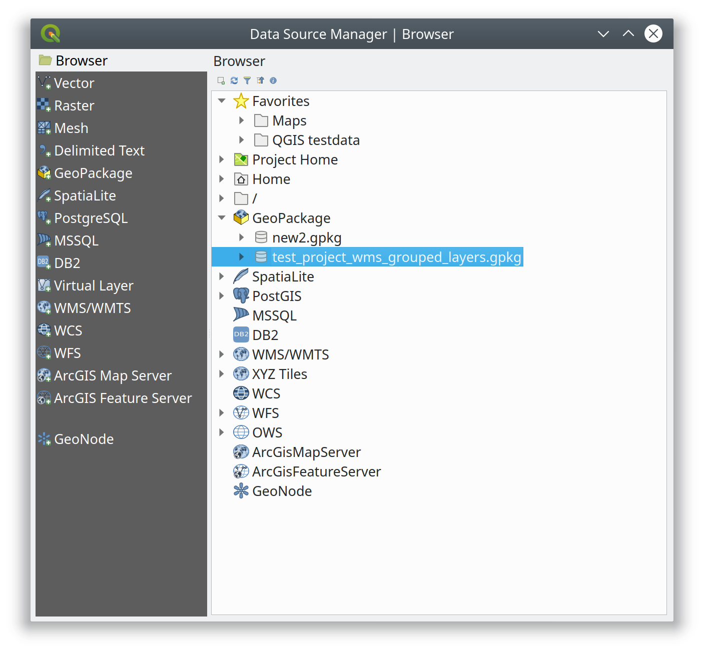
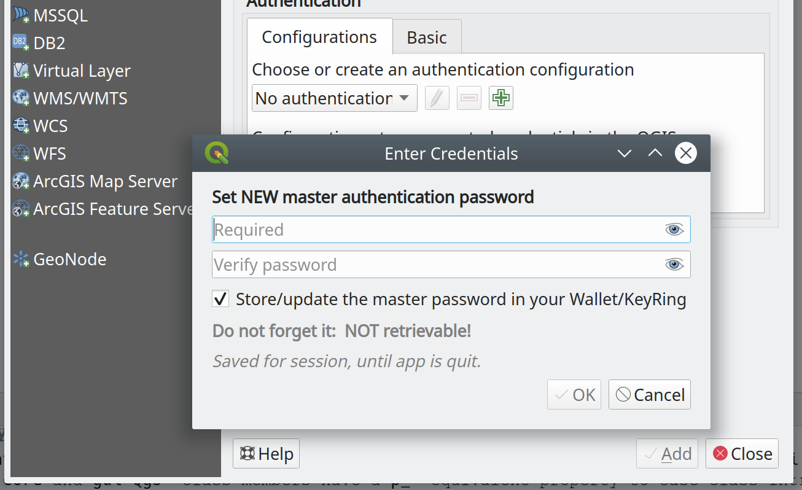
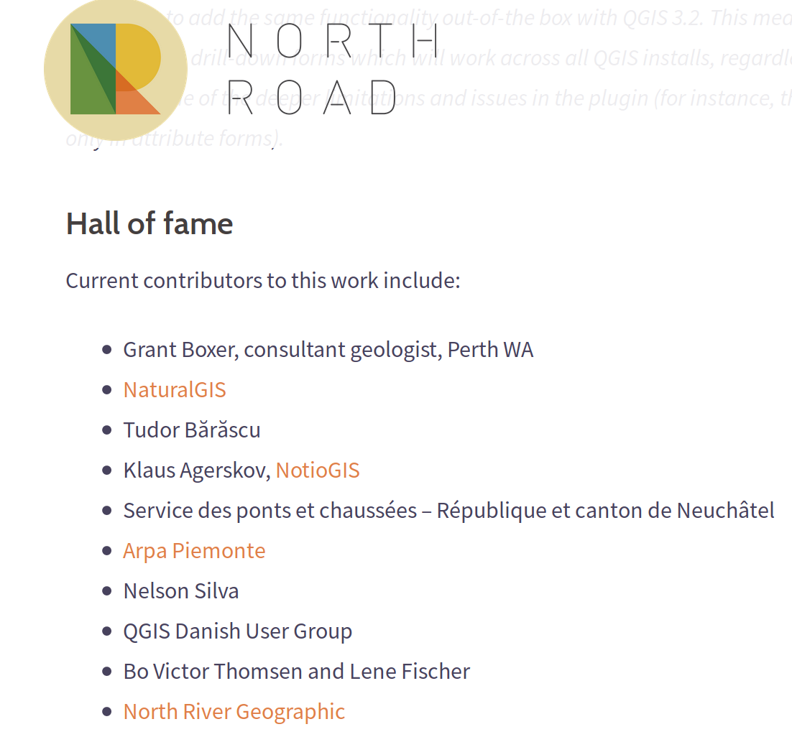
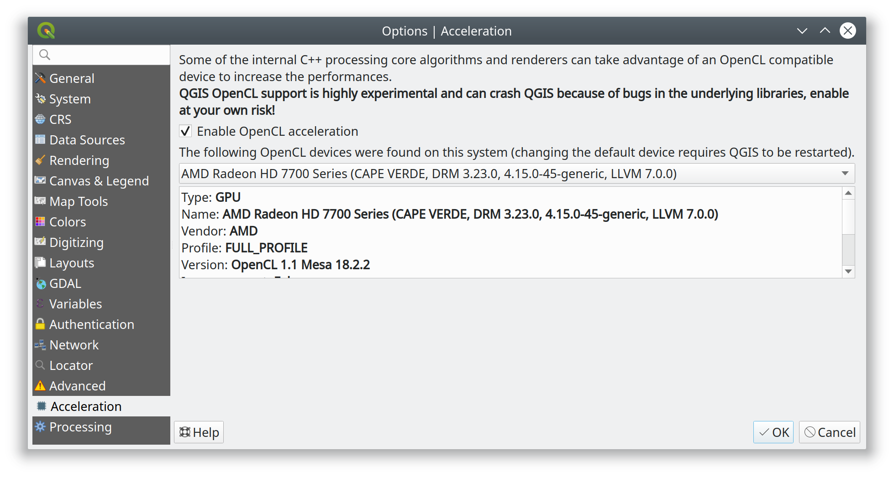

@title[Come fare lo sviluppatore O.S. senza andare in bancarotta]

## Come fare lo sviluppatore O.S. senza andare in bancarotta

---
### Chi sono

+ Alessandro Pasotti - aka `@elpaso`
+ ItOpen - [www.itopen.it](https://www.itopen.it)
+ **15** anni come sviluppatore GIS Open Source

---

### QGIS Core

+ C++ / Python

Statistiche (solo C++)

|Language           | files     |    code  |
|-------------------|----------:|---------:|
|C++                |  1'743    |  560'249 |
|Qt  (GUI)          |    336    |  121'889 |
|C/C++ Header       |  1'818    |  110'450 |

+ 511 unit tests

---

### Come funziona

+ Feature
+ Bugfixing

(Non-)Modello di gestione "Code'n fix"

---

### Perchè funziona

+ Peer-review
+ Q.E.P per feature complesse
+ Community (Hackfest!!!)

---

### Le ditte

+ Il caso Boundless
+ 7 sviluppatori (4 core developers)
+ centinaia di migliaia di US $ investiti per 3 anni
+ feature e **bugfixing**

---

### Data Source Manager e GPKG

---

### Master Password e auth widget

---

### Crowdfunding

Drill-Down in form value relation widget

---

### Drill-down HOF

---

### QGIS Grant

+ OpenCL acceleration

---
