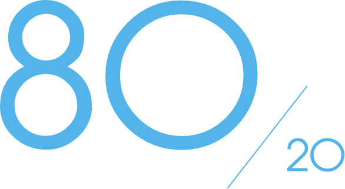
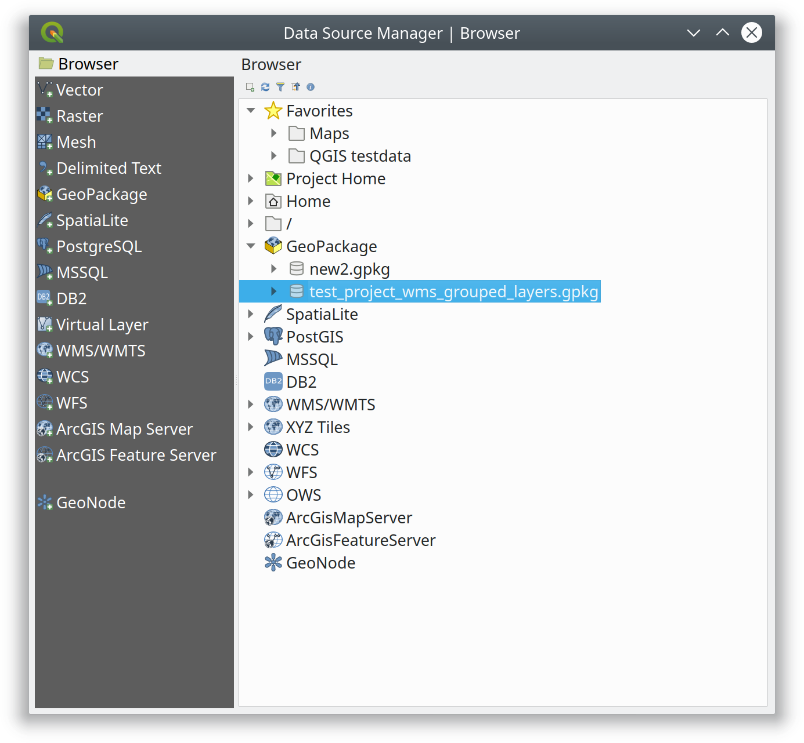
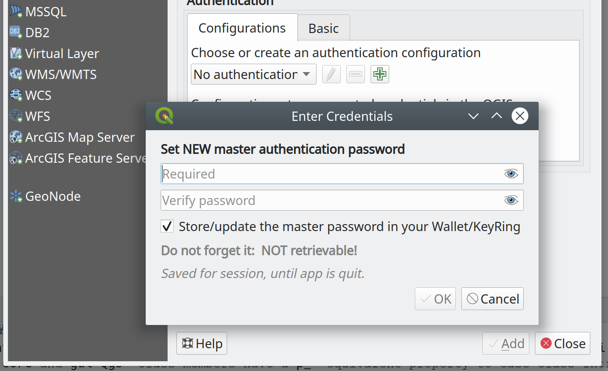
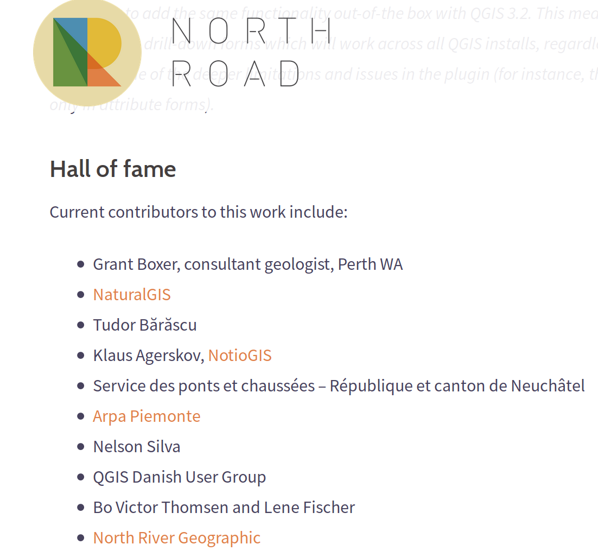
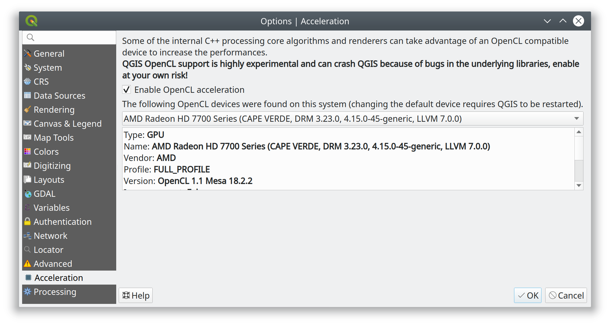

:css: custom-hov.css

.. title:: QGIS: chi paga?

===========================================================
QGIS: chi paga?
===========================================================

Oppure: come fare lo sviluppatore O.S. senza andare in bancarotta

----

Chi sono
=========================================================

-----------------------------------------------------
Alessandro Pasotti (elpaso@itopen.it)
-----------------------------------------------------

+ Alessandro Pasotti - aka `@elpaso`
+ ItOpen - https://www.itopen.it
+ **15** anni come sviluppatore GIS Open Source

----

QGIS Core
=========================================================

C++ / Python

Statistiche (solo C++)

================== ============= =========
Language            Files         LOC
================== ============= =========
C++                        1'743   560'249
Qt  (GUI)                    336   121'889
C/C++ Header               1'818   110'450
================== ============= =========

511 unit test

----

Come funziona
=========================================================

+ (Non-)Modello di gestione **Code'n fix**

.. class:: substep

    - Nuove funzionalità

    - Refactoring
    - Bugfixing

.. class:: substep
.. class:: align-right
.. class:: scale-50

----

Perchè funziona
=========================================================

.. class:: substeps

    + Peer-review
    + Q.E.P. per feature complesse
    + Community (Hackfest!!!)
    + Unit tests

----

Le ditte
=========================================================

.. class:: substeps

    + Il caso Boundless
    + 7 sviluppatori (4 core developers)
    + Centinaia di migliaia di US $ investiti per 3 anni
    + Feature e **bugfixing**

----

Data Source Manager e GPKG
=========================================================

----

Master Password e auth widget
=========================================================

----

Earmarked sponsorship
=========================================================

.. class:: substeps

    + Change data source
    + Bad layers dialog

----

Crowdfunding
=========================================================

Drill-Down in form value relation widget

.. image:: ./images/drill-down.gif

----

Drill-down HOF
=========================================================

----

QGIS Grant
=========================================================

OpenCL acceleration

----

Paid bugfixing program
=========================================================

Donazioni: coprono circa il 30% dei bug fix

